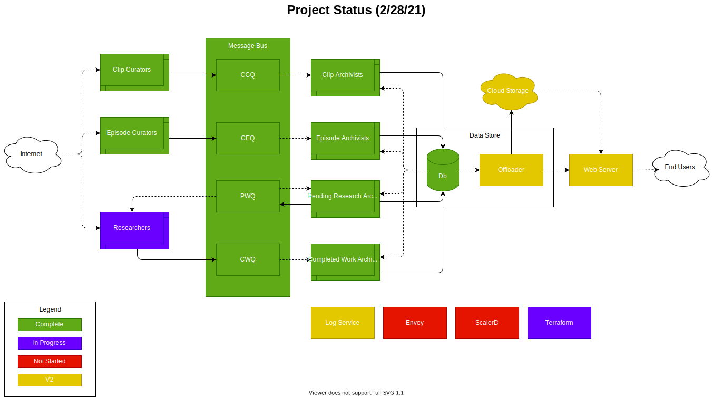
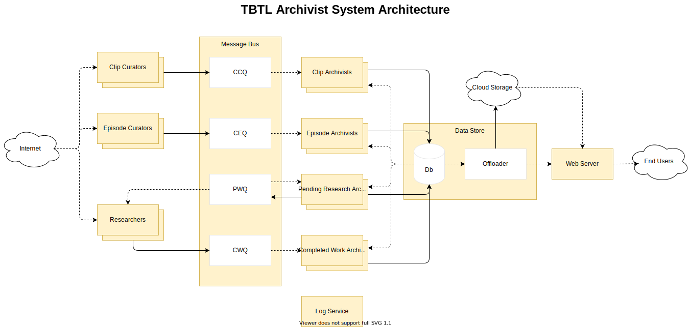
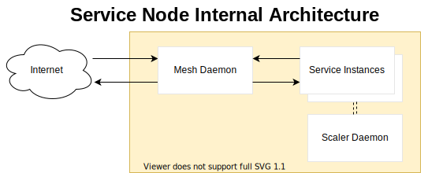
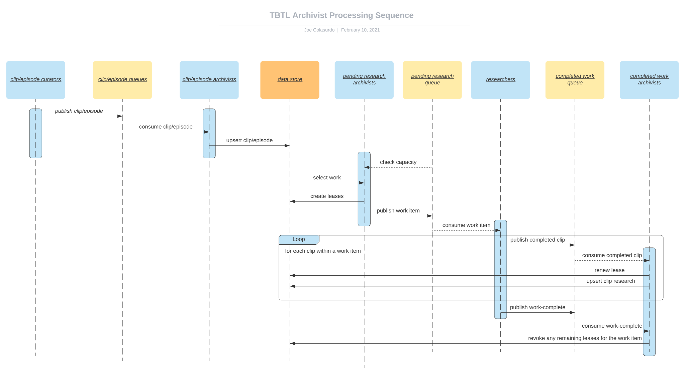

# TBTL Archivist

# Work Assignment Process
## Checking Capacity
Each time a pending-work-archivist activates, it follows these steps:
1) Identify how many researchers are currently associated with the pending-work queue
2) Identify how many pending work items are currently in the pending-work queue
3) If there are no researchers and no pending work items, move to step 7. Else continue to the next step.
4) If there are no researchers but one or more pending-work-items, exit. Else, continue to the next step.
5) If we're here, we have at least one active researcher. The pending-work-archivist then calculates its current position by subtracting the number of work-items from the number of researchers.
    - Example:
      - *If there are 3 researchers and 4 work-items the current position is 3 minus 4, which is -1.*
      - *If there is 1 researcher and 1 work-items the current position is 1 minus 1, which is 0.*
      - *If there are 5 researchers and 2 work-items the current position is 5 minus 2, which is 3.*
6) If the current position is negative, we have a surplus of work and we exit. Else continue to the next step.
7) Add one more work-item to the queue then return to step 1.

## Adding a Work-Item to the Queue
Once the pending-work-archivist has determined that a work-item should be added to the queue, it takes the following steps:
1) Selecting work
2) Create leases for the selected work
3) Send the work-item to the queue

## Selecting Work
A PWA will create a work-item based on the following process.

> **Episode and clip curated "priority" values:** Upstream episode and clip curator services optionally assign each episode or clip a priority value. This value is an integer where higher values represent a higher priority over lower values. The values used for clips are contextually independent from the values used for episodes and vice versa. That is to say that clip priority values only have meaning within the context of clips, and episode priority values only have meaning within the context of episodes. Priority values can be arbitrarily assigned, but should be agreed upon across curators to ensure that they are applied in a meaningful and consistent manner by the archivists. The specifics about how priority values are applied are coverd in the following sections.

**Identifying Episodes:**

Episodes take priority over clips because they are the base unit of work assigned to each researcher, and are the central data element of the TBTL Archivist system as a whole. A PWA will select the highest priority episode to assign. *(Note that the actual algorithm may differ in its implementation, but achieves the same result.)*

0) If at any point no remaining episodes meet criteria, then the PWA simply makes no assignment and exits.
1) Consider all episodes in the data store.
2) Remove all episodes for which research is complete (i.e. there are no unresearched clips for the episode).
3) Remove all episodes for which there are no unleased clips (i.e. there is research to do, but all is currently leased).
4) Of the remaining episodes:
    - Sort them first descending by their assigned "priority" value.
    - Within "priority", sort them descending by their initial curation date.
      - *Two curation dates are tracked for each episode. The initial curation date, and the latest curation date. The lastest curation date can be expected to get updated frequently, and is not a useful indicator of the relative age of an episode.*
5) The top item has the most recent curation date for the highest "priority" value. This is the episode that will be assigned.
6) Move on to identify which clips to lease for this episode.

**Identifying clips:**

0) If at any point no remaining clips meet criteria, then PWA simply makes no assignment and exits.
1) Consider all clips in the data store.
2) Remove all clips for which research is complete for the selected episode.
3) Remove all clips that have an active lease for the selected episode.
4) Of the remaining clips:
    - Sort them decending by their assigned "priority" value.
    - Within "priority", sort them descending by their initial curation date.
      - *Two curation dates are tracked for each clip. The initial curation date, and the latest curation date. The lastest curation date can be expected to get updated frequently, and is not a useful indicator of the relative age of a clip.*
5) Limit the resulting list of clips to the "max-clip limit".

At this point, the PWA has selected which work it would like to assign. 

## Creating Leases
With a set of work identified, PWA creates a new lease in the datastore, which consists of the following:
 - A lease ID
 - The episode
 - A list of clips
 - The lease expiration datetime

## Publishing a Work-Item
With a set of work identified and leased, PWA can now publish the work-item to the pending-work queue.
This is simply an object that contains the lease ID, episode information, and list of clips to research for the episode.

**Note that the TTL for the work-item in the pending-work queue should be set to a value less than the lease duration used to calculate the lease expiration datetime. This ensures that if there is a surplus of work-items in the pending-work queue, that they items in the queue expire before the corresponding lease in the datastore expires. This prevents the PWA from accidentally trying to assign work to the pending queue that hasn't expired from the queue yet.**

# Work Completion Process
As work-items are placed on the pending work queue, downstream Researchers will consume the work-items from the queue. 
1) The Researcher starts by downloading the episode, 
2) The researcher then begins analyzing each clip against the episode.
3) As each clip is analyzed, the researcher immediately reports the results of the clip analysis back to the completed-work-archivist (CWA).
4) Along with the clip analysis, the researcher includes a the lease ID for the work it accepted.
5) The CWA then uses that lease ID to extend the lease deadline for the associated work-item. This prevents the PWA service from trying to assign clips that are actively being researched.
6) Once all clips have been researched, or if the researcher is trying to otherwise wind down cleanly, it flags its last completed-research item as being final.
7) Upon receiving a final completed-research item, the PWA revokes the work-item lease.

**Note that if a researcher submits items that have no lease (same as a revoked lease) or an expired lease, the CWA will still submit the work to the datastore. However, since no lease exists, no lease will be extended. This situation could arise in the following circumstances (among others perhaps):**

- A researcher started working on a work-item, but hung for an extended duration. Its leases expired, but when it came back online it resumed sending results back to the completed work queue. This doesn't pose any threat to the system other than being inefficient. If, in the meantime, another service has started work on a new lease that covers the same clip and episode, that work will continue unaffected. The original reseracher's transmissions will not alter the new reseracher's leases, since they are isolated by lease-id.
- A researcher is sending a bunch of completed clips back to the completed work queue. Multiple CWA services are working in parallel pulling items off of the queue. One CWA service receives the completed-research item that has been flagged as final, and in response revokes the associated lease. The other parallel CWA instances have no awareness that the final item was received and that the lease was revoked. Their calls to extend the revoked lease simply have no effect. Their results are otherwise ingested into the database as normal.
- A related circumstance is that a final completed-research item is never received. This could occur because a researcher failed to complete its work, is misconfigured and didn't send the notification when it should have, or due to a failure in the message bus. In this situation, the leases will simply expire after some time, and remaining unresolved work will be identified and prioritized by a PWA service on its next run.
